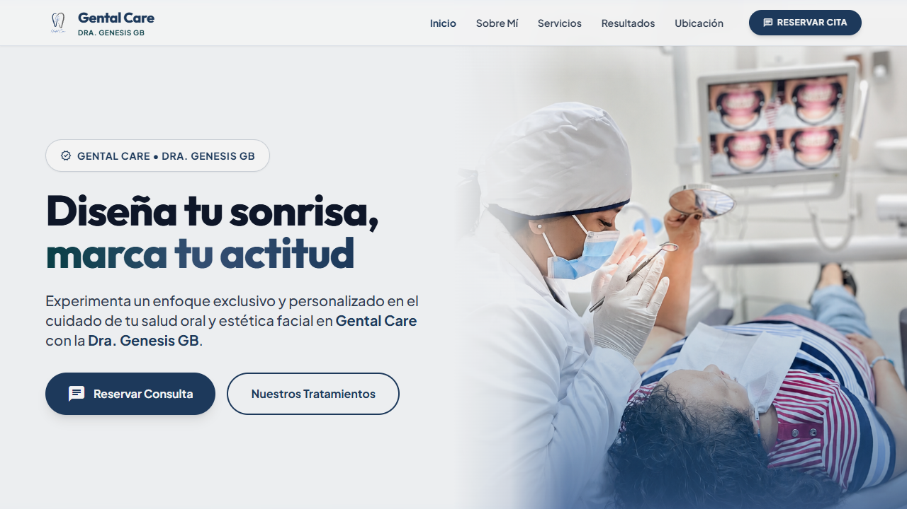

# Gental Care & Armonización Facial
Plataforma web oficial e interactiva para **Gental Care & Armonización Facial**, dirigida por la **Dra. Genesis GB**. Diseñada con un enfoque estético de nivel premium, responsivo y orientado a la conversión de citas clínicas.



**Visita el sitio:** [https://gentalcare.vercel.app](https://gentalcare.vercel.app)

---

## ✨ Características Destacadas

- 🩺 **Presentación Profesional de la Especialista**: Sección dedicada con biografía, visión clínica y valores de la Dra. Genesis GB.
- 💎 **Catálogo de Tratamientos Estéticos**: Tarjetas dinámicas e interactivas para odontología estética, armonización facial, diseño de sonrisa, carillas de resina/porcelana y profilaxis avanzada.
- 🖼️ **Galería de Resultados**: Muestra visual de casos reales de pacientes (Antes / Después).
- 📲 **Reserva Inmediata de Citas**: Botones estratégicos de CTA (*Call to Action*) conectados directamente con la API de WhatsApp Business.
- 📍 **Ubicación e Información de Contacto**: Integración con Google Maps, horarios de atención y redes sociales.
- 📱 **Diseño 100% Responsivo**: Experiencia fluida adaptada a smartphones, tablets y pantallas de escritorio.
- 🎨 **Estética Visual Premium**: Paleta de colores armónicos, tipografía limpia (Google Fonts), desenfoques *glassmorphism* y animaciones dinámicas al hacer scroll (*Scroll Reveal*).

---

## 🛠️ Tecnologías Utilizadas

| Tecnología | Descripción |
|---|---|
| **HTML5 Semántico** | Estructura optimizada para SEO, accesibilidad y rendimiento. |
| **Tailwind CSS** | Framework CSS de utilidades para un diseño moderno y responsive. |
| **Vanilla JavaScript (ES6+)** | Lógica de interactividad, menú móvil responsive, filtrado de galería y animaciones. |
| **Google Fonts & Icons** | Tipografías *Outfit* e *Inter*, junto con *Material Symbols Outlined*. |
| **Vercel** | Infraestructura de despliegue continuo en la nube. |

---

## 📁 Estructura del Proyecto

```text
Gental Care & Armonización facial/
├── img/                       # Recursos gráficos e imágenes del proyecto
│   ├── Caso1.jpg              # Galería de casos clínicos
│   ├── Caso2.jpg
│   ├── Caso3.jpg
│   ├── Doctora.jpg            # Retrato de la Dra. Genesis GB
│   ├── LogoFondoBlanco.svg    # Logotipo del consultorio (Fondo blanco / Favicon)
│   ├── LogoTransparente.svg   # Logotipo del consultorio (Fondo transparente)
│   ├── Portada.png            # Imagen principal de cabecera (Hero)
│   └── preview.png            # Captura de pantalla para documentación del repositorio
├── index.html                 # Estructura principal y marcado semántico
├── script.js                  # Lógica interactiva de JavaScript
├── style.css                  # Estilos personalizados y tokens de diseño
└── README.md                  # Documentación oficial del proyecto
```

---

## 🚀 Instalación y Ejecución Local

Para clonar y explorar este proyecto en tu entorno local:

1. **Clonar el repositorio:**
   ```bash
   git clone https://github.com/Its-Alexandder/gental-care.git
   ```

2. **Acceder al directorio:**
   ```bash
   cd gental-care
   ```

3. **Abrir en el navegador:**
   - Puedes abrir directamente el archivo `index.html` en tu navegador predeterminado.
   - O usar una extensión de servidor local como **Live Server** en VS Code.

---

## 👨‍💻 Autor y Créditos

- **Profesional:** Dra. Genesis GB — *Gental Care & Armonización Facial*
- **Desarrollador Web:** [Alexander Alfonso](https://github.com/Its-Alexandder)

---

<p align="center">
  <sub>Desarrollado con ❤️ para <b>Gental Care</b></sub>
</p>
